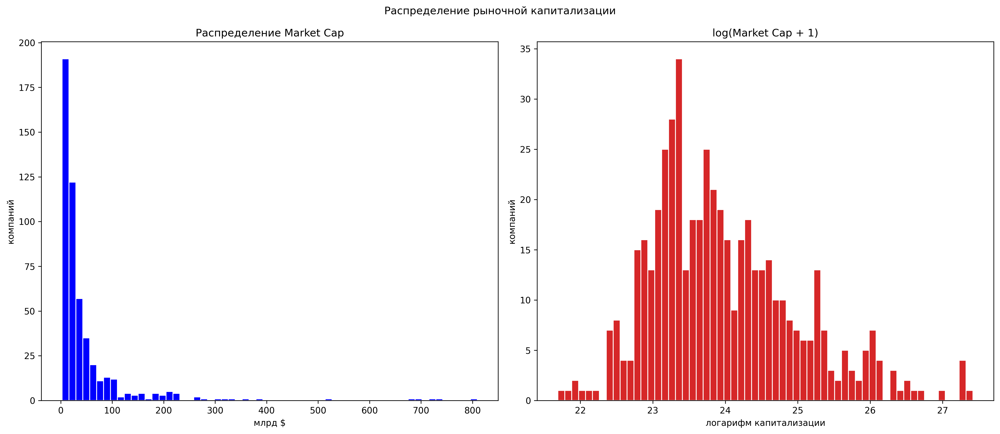
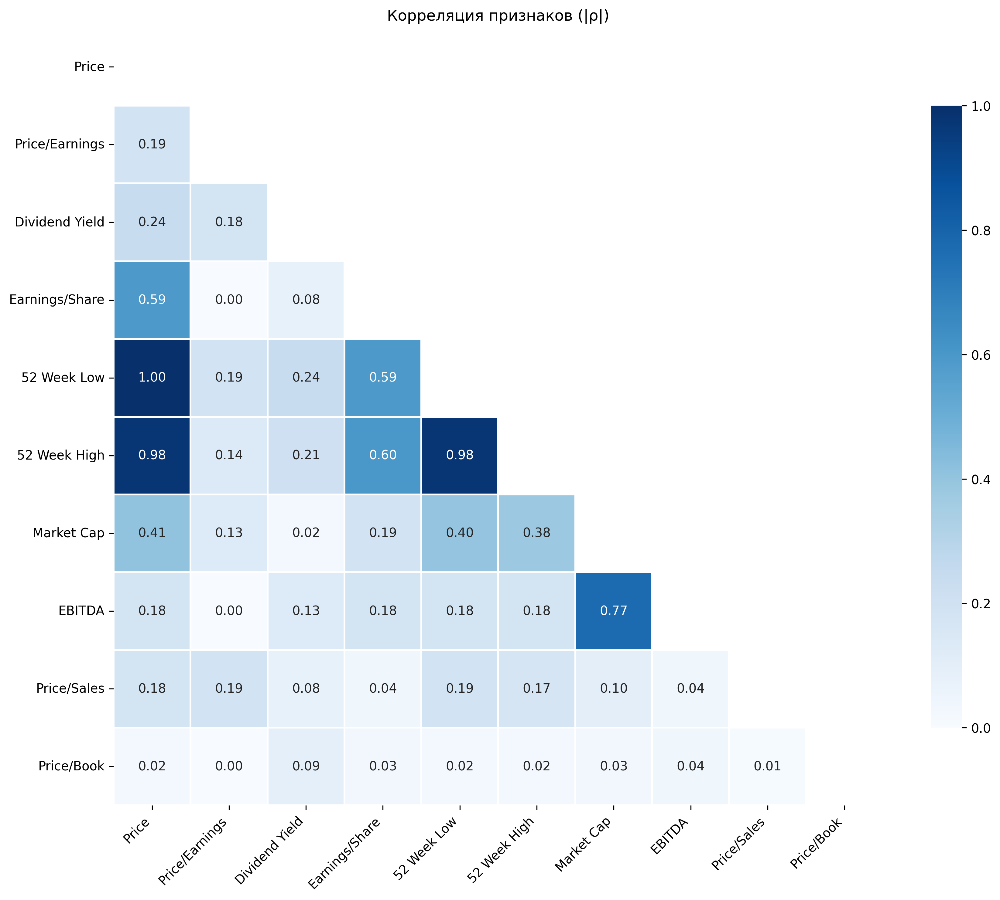
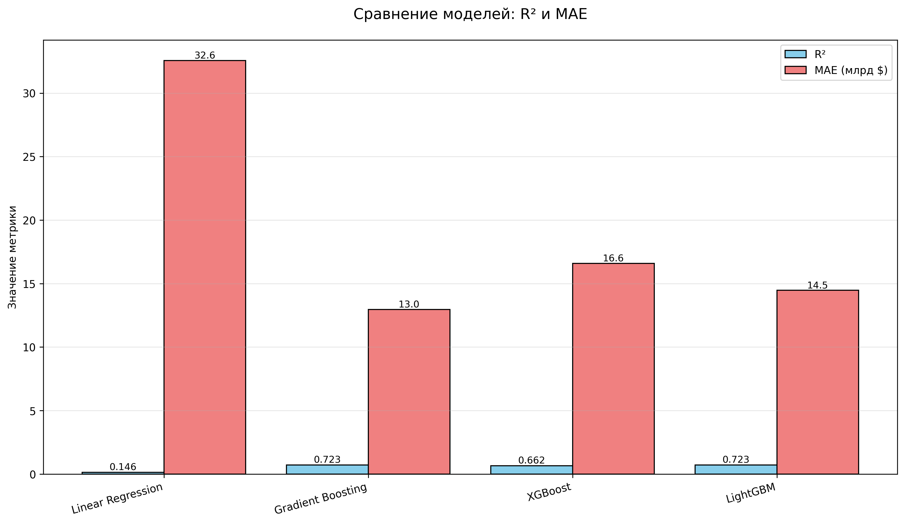

## 📍 Описание проекта
Цель проекта — разработать модель машинного обучения, способную **предсказывать стоимость компании на основе косвенных признаков**.  

В процессе работы используется корреляционный анализ, визуализация данных и построение таких моделей как: 

1. Линейная регрессия (Linear Regression)
2. Gradient Boosting (Scikit-learn)
3. XGBoost (Extreme Gradient Boosting)
4. LightGBM (Light Gradient Boosting Machine)

Проект выполнен в рамках учебного кейса №8 по направлению "Машинное обучение".

---

## 🧩 Этапы проекта
1. Изучение и анализ данных (EDA)
2. Проверка корреляций между признаками
3. Построение и обучение регрессионных моделей
4. Оценка результатов и визуализация
5. Подготовка презентации и выводов

---

## 📝 Инструменты
- Python 3.x  
- Jupyter Notebook  
- NumPy, Pandas  
- Matplotlib, Seaborn  
- Scikit-learn
- SHAP для интерпретации моделей

---

## 📁 Структура проекта
project/
├── data/              # Исходные данные (не включены в репозиторий)
├── src/               # Исходный код
├── models/            # Сохранённые модели (не включены)
├── results/plots/     # Графики анализа
├── main.py            # Точка входа
├── requirements.txt   # Зависимости
└── README.md          # Эта документация

## 💡 Модели

- Линейная регрессия (Linear Regression)

- Gradient Boosting (sklearn)

- XGBoost

- LightGBM

## 🎉 Результаты проекта
Проект создаёт 5 ключевых графиков:

- 1_eda_distribution.png - распределение капитализации

- 2_eda_correlation.png - матрица корреляций

- 3_models_comparison.png - сравнение моделей

- 4_shap_summary.png - важность признаков

- 5_shap_waterfall_*.png - анализ ошибок

## Распределение капитализации

## Матрица корреляций

## Сравнение моделей

